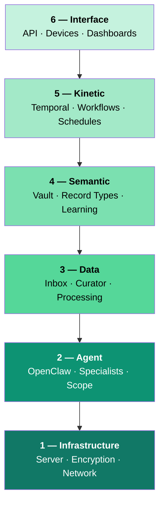

Alfred is a full-stack private intelligence service. Every subscriber gets a dedicated machine — no shared infrastructure, no multi-tenant databases, no commingled data. The entire system is organized in six layers, each with a clear responsibility.

---

## Layer 1 — Infrastructure

**Your dedicated machine.**

Every Alfred instance runs on its own Hetzner VPS. Data is encrypted at rest with LUKS2 (AES-256-XTS). All services bind to localhost — zero public ports. External access is exclusively through your Tailscale mesh network, which provides end-to-end WireGuard encryption.

No shared infrastructure between subscribers. Your data never touches another subscriber's machine.

<Card title="Infrastructure deep dive" icon="server" href="/architecture/infrastructure">
  Dedicated servers, encryption, network isolation, container hardening, and data lifecycle.
</Card>

---

## Layer 2 — Agent

**Your team of specialists.**

OpenClaw is the AI agent runtime. It hosts four specialist workers — Curator, Janitor, Distiller, and Surveyor — each with strictly enforced scope permissions. Agents interact with your vault only through the `alfred vault` CLI gate; they never touch the filesystem directly.

| Specialist | Role | Trigger |
|-----------|------|---------|
| **Curator** | Processes raw inbox files into typed vault records | Watches `inbox/` for new files |
| **Janitor** | Scans for and fixes structural issues (broken links, bad frontmatter) | Periodic sweeps |
| **Distiller** | Extracts assumptions, decisions, constraints from records | On-demand or scheduled |
| **Surveyor** | Embeds, clusters, labels, and discovers relationships | Pipeline execution |

<Card title="Agent deep dive" icon="robot" href="/architecture/agent">
  OpenClaw runtime, specialist roles, scope enforcement, and prompt injection defense.
</Card>

---

## Layer 3 — Data

**Your world, flowing in.**

Raw inputs — meeting notes, conversations, documents, transcripts — enter through the inbox. The Curator watches for new files, invokes an AI agent to parse the raw content, and produces structured vault records with proper frontmatter, types, and wikilinks.

Supported formats include plain text, Markdown, JSON, CSV, PDFs, and URLs. Everything that enters the inbox is processed, structured, and filed.

<Card title="Data deep dive" icon="database" href="/architecture/data">
  Inbox pipeline, processing workflow, and supported input formats.
</Card>

---

## Layer 4 — Semantic

**Your structured knowledge.**

The vault is an Obsidian-compatible collection of Markdown files with YAML frontmatter. Alfred supports 25 record types organized into two categories: 20 entity types (person, org, project, task, etc.) for operational records, and 5 learning types (assumption, decision, constraint, contradiction, synthesis) for extracted knowledge.

Records connect through wikilinks (`[[type/Record Name]]`), forming a growing knowledge graph. The Distiller continuously analyzes operational records and extracts latent knowledge into learning records.

<Card title="Semantic deep dive" icon="brain" href="/architecture/semantic">
  Vault structure, record types, relationships, and the learning cycle.
</Card>

---

## Layer 5 — Kinetic

**Your actions in motion.**

Temporal is the workflow orchestration engine. It manages durable workflows with automatic retries, cron schedules, and signal handling. Workers run as Temporal activities — the Curator's inbox processing, the Janitor's periodic sweeps, and the Distiller's knowledge extraction are all orchestrated as Temporal workflows.

Workflows can be started, stopped, signaled, and monitored through the API.

<Card title="Kinetic deep dive" icon="gears" href="/architecture/kinetic">
  Temporal engine, workflow orchestration, schedules, and worker pipeline.
</Card>

---

## Layer 6 — Interface

**Your points of contact.**

Everything is accessible through the REST API over your Tailscale mesh network. The API provides 80+ endpoints across 8 domains: vault operations, worker control, workflow orchestration, device management, OpenClaw gateway, log streaming, scheduling, and instance administration.

OpenClaw devices (mobile, desktop, web clients) connect through a pairing workflow with token-based authentication. Every interaction — whether through the API, a paired device, or SSH — travels over encrypted channels.

<Card title="Interface deep dive" icon="display" href="/architecture/interface">
  REST API, device pairing, access channels, and the dashboard.
</Card>

---

## Always working

Alfred doesn't wait for you to ask. Background processes run continuously:

| Process | Frequency | Layer |
|---------|-----------|-------|
| Inbox processing | Watches for new files | Data |
| Vault health scans | Periodic sweeps | Agent |
| Knowledge extraction | On-demand + scheduled | Semantic |
| Workflow orchestration | Continuous | Kinetic |
| Health monitoring | Every 2 minutes | Infrastructure |
| Encrypted backups | Daily at 3 AM | Infrastructure |

---

## Explore each layer

<CardGroup cols={3}>
  <Card title="Infrastructure" icon="server" href="/architecture/infrastructure">
    Dedicated servers, encryption, network isolation
  </Card>
  <Card title="Agent" icon="robot" href="/architecture/agent">
    OpenClaw runtime, specialists, scope enforcement
  </Card>
  <Card title="Data" icon="database" href="/architecture/data">
    Inbox pipeline, processing, input formats
  </Card>
  <Card title="Semantic" icon="brain" href="/architecture/semantic">
    Vault structure, record types, learning
  </Card>
  <Card title="Kinetic" icon="gears" href="/architecture/kinetic">
    Temporal engine, workflows, schedules
  </Card>
  <Card title="Interface" icon="display" href="/architecture/interface">
    REST API, devices, access channels
  </Card>
</CardGroup>
