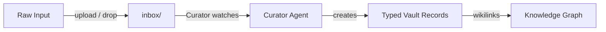

<Note>
This is **Layer 3** of Alfred's [six-layer architecture](/architecture). The Data layer captures your world and feeds it into the vault.
</Note>

## What the Data Layer does

The Data Layer is responsible for getting information into Alfred. Raw inputs enter through the inbox, get processed by the Curator specialist, and emerge as structured vault records with proper types, frontmatter, and wikilinks.



## The inbox

The inbox (`/mnt/encrypted/vault/inbox/`) is the entry point for all raw content. Files can arrive through:

- **API upload** — `POST /api/v1/vault/inbox` for single files, `POST /api/v1/vault/inbox/bulk` for batches
- **Direct file drop** — place files directly in the inbox directory (via SSH or mounted volume)
- **Text snippets** — submit raw text via the API without a file

The inbox is a staging area. Files sit there until the Curator processes them, then they're marked as handled.

## Supported formats

The Curator can process a wide range of input formats:

| Category | Formats |
|----------|---------|
| **Text** | Plain text, Markdown, rich text |
| **Documents** | PDF, Word, meeting transcripts |
| **Web** | URLs, web page content |
| **Code** | Source files, configuration files |
| **Data** | JSON, CSV, YAML |

## Processing pipeline

When the Curator picks up an inbox file:

<Steps>
  <Step title="Read the raw content">
    The Curator reads the file and determines its type and structure.
  </Step>
  <Step title="Build the processing prompt">
    A prompt is assembled from the Curator's skill file (`SKILL.md`), relevant vault context, and the raw content.
  </Step>
  <Step title="Invoke the AI agent">
    The prompt is sent to an LLM backend through OpenClaw. The agent analyzes the content and determines what vault records to create.
  </Step>
  <Step title="Create structured records">
    The agent creates vault records via the `alfred vault` CLI — each with proper `type`, frontmatter fields, wikilinks to related records, and Markdown body content.
  </Step>
  <Step title="Mark as processed">
    The file is recorded in `curator_state.json` so it won't be processed again.
  </Step>
</Steps>

A single inbox file can produce multiple vault records. A meeting transcript, for example, might generate a `meeting` record, several `task` records, and links to existing `person` records.

## Automatic vs. manual processing

By default, the Curator watches the inbox continuously and processes new files as they appear. You can also trigger processing manually:

```bash
# Trigger immediate processing of all pending inbox files
curl -X POST https://<instance>.ts.net/api/v1/workers/curator/process \
  -H "Authorization: Bearer $AAS_API_KEY"
```

## Next steps

<CardGroup cols={2}>
  <Card title="Inbox Workflow" icon="inbox" href="/guides/inbox-workflow">
    Step-by-step guide to uploading and processing files
  </Card>
  <Card title="Worker Operations" icon="gears" href="/guides/worker-operations">
    Control the Curator and other workers
  </Card>
</CardGroup>
