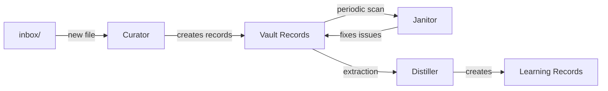

<Note>
This is **Layer 5** of Alfred's [six-layer architecture](/architecture). The Kinetic layer turns knowledge into action through durable workflows.
</Note>

## What the Kinetic Layer does

The Kinetic Layer is Alfred's execution engine. It orchestrates when and how work happens — from processing inbox files to running scheduled vault health scans to extracting knowledge on a cron schedule.

## Temporal — the execution engine

[Temporal](https://temporal.io) provides durable workflow orchestration. Unlike simple cron jobs, Temporal workflows are:

- **Durable** — workflows survive process restarts and server reboots
- **Retriable** — failed activities are automatically retried with configurable backoff
- **Observable** — every workflow execution is logged with full history
- **Signalable** — running workflows can receive external signals to change behavior

Temporal runs as a Docker container with SQLite storage on the encrypted volume. Its UI is accessible at port 8233 via Tailscale Serve.

## The worker pipeline

All three specialist workers are orchestrated as Temporal activities:

### Curator workflow

Watches the inbox for new files. When one appears:
1. Reads the raw content
2. Builds a prompt from the skill file + vault context
3. Invokes the AI agent to create structured records
4. Marks the file as processed

### Janitor workflow

Periodically sweeps the vault:
1. Scans for broken wikilinks, invalid frontmatter, missing required fields, orphaned records
2. Reports issues with severity levels
3. Invokes the AI agent to fix them (or flags for manual review)

### Distiller workflow

Analyzes operational records for latent knowledge:
1. Scans records for implicit assumptions, decisions, constraints
2. Checks for duplicates against existing learning records
3. Creates new learning records with source links

## Workflow management

All workflows can be managed through the API:

| Operation | Endpoint | Description |
|-----------|----------|-------------|
| **List** | `GET /api/v1/workflows` | List all running workflows |
| **Describe** | `GET /api/v1/workflows/:id` | Get workflow details and status |
| **Start** | `POST /api/v1/workflows` | Start a new workflow execution |
| **Signal** | `POST /api/v1/workflows/:id/signal` | Send a signal to a running workflow |
| **Cancel** | `POST /api/v1/workflows/:id/cancel` | Request graceful cancellation |
| **Terminate** | `POST /api/v1/workflows/:id/terminate` | Force-stop a workflow |
| **History** | `GET /api/v1/workflows/:id/history` | Get execution history |

## Schedules

Temporal schedules automate recurring work:

| Operation | Endpoint |
|-----------|----------|
| **List** | `GET /api/v1/schedules` |
| **Create** | `POST /api/v1/schedules` |
| **Delete** | `DELETE /api/v1/schedules/:id` |
| **Pause** | `POST /api/v1/schedules/:id/pause` |
| **Unpause** | `POST /api/v1/schedules/:id/unpause` |
| **Trigger** | `POST /api/v1/schedules/:id/trigger` |

## Background processes

Alfred runs several background processes continuously:

| Process | Frequency | What it does |
|---------|-----------|-------------|
| Inbox processing | Watches for new files | Curator processes raw inputs into records |
| Vault health scan | Periodic sweeps | Janitor checks for structural issues |
| Knowledge extraction | On-demand + scheduled | Distiller extracts learning records |
| Health monitoring | Every 2 minutes | Control plane checks instance health |
| Encrypted backups | Daily at 3 AM | Restic backup to Acme Cloud S3 |

## Next steps

<CardGroup cols={2}>
  <Card title="Worker Operations" icon="gears" href="/guides/worker-operations">
    Start, stop, restart, and troubleshoot workers
  </Card>
  <Card title="Workflow API" icon="diagram-project" href="/api-reference/workflows/list">
    Full workflow management endpoints
  </Card>
  <Card title="Schedule API" icon="clock" href="/api-reference/schedules/list">
    Manage cron schedules
  </Card>
</CardGroup>
