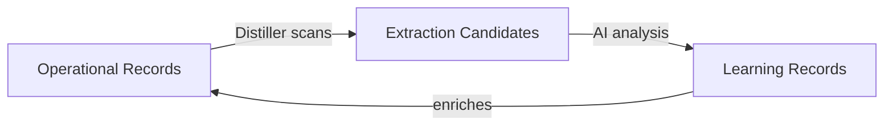

<Note>
This is **Layer 4** of Alfred's [six-layer architecture](/architecture). The Semantic layer is where raw data becomes structured knowledge.
</Note>

## The vault — structured knowledge

The vault is an Obsidian-compatible collection of Markdown files with YAML frontmatter. Every piece of knowledge Alfred manages is a `.md` file with a defined type, structured metadata, and wikilinks to related records.

```markdown
---
type: person
role: Senior Software Engineer
org: "[[org/Acme Corp]]"
email: alice@acme.com
tags: [engineering, backend]
---

# Alice Smith

Notes about Alice go here. You can use [[project/Q1 Launch]]
to reference other records.
```

The vault lives on the LUKS-encrypted volume at `/mnt/encrypted/vault/`, organized into directories by record type.

## 25 record types across two categories

### Entity types (20)

Operational records representing the tangible elements of your world:

| Type | Purpose |
|------|---------|
| `person` | People and contacts |
| `org` | Organizations and companies |
| `project` | Projects and initiatives |
| `task` | Tasks and action items |
| `event` | Events and occurrences |
| `meeting` | Meetings and discussions |
| `note` | General notes and observations |
| `resource` | External resources and references |
| `tool` | Tools and software |
| `concept` | Concepts and ideas |
| `location` | Physical or virtual locations |
| `goal` | Goals and objectives |
| `metric` | Metrics and measurements |
| `process` | Processes and workflows |
| `system` | Systems and architectures |
| `artifact` | Artifacts and deliverables |
| `channel` | Communication channels |
| `tag` | Tags and categories |
| `view` | Saved views and queries |
| `template` | Templates and scaffolds |

### Learning types (5)

Meta-records that capture latent knowledge extracted by the Distiller:

| Type | Purpose |
|------|---------|
| `assumption` | Implicit assumptions found in operational records |
| `decision` | Decisions and their rationale |
| `constraint` | Constraints, limitations, or boundaries |
| `contradiction` | Contradictions or conflicts across records |
| `synthesis` | Synthesized insights connecting multiple records |

Learning types live in the `_learn/` directory to distinguish them from entity types.

## How records connect

Records reference each other through wikilinks using the `[[type/Record Name]]` syntax. These links are bidirectional — if a meeting references a person, that person's record knows about the meeting.

As more content flows through Alfred, the knowledge graph grows richer. A `person` record might start with just a name and role, then accumulate links from meetings, tasks, projects, and decisions over time.

<Tip>
The vault is fully compatible with Obsidian. You can open it directly in Obsidian to browse, search, and visualize the knowledge graph.
</Tip>

## The learning cycle

The Distiller specialist drives Alfred's self-improving intelligence:



1. **Scan** — The Distiller identifies operational records that contain implicit knowledge (decisions, assumptions, constraints)
2. **Extract** — An AI agent analyzes the candidates and creates learning-type records
3. **Enrich** — Learning records link back to their sources, creating a feedback loop that makes the vault increasingly self-aware

Over time, Alfred surfaces patterns you might not notice: contradictions between goals and constraints, recurring assumptions across projects, and synthesized insights that connect disparate areas of your work.

## Next steps

<CardGroup cols={3}>
  <Card title="Vault Schema" icon="database" href="/concepts/vault-schema">
    Complete record format and structure reference
  </Card>
  <Card title="Record Types" icon="shapes" href="/concepts/record-types">
    Detailed reference for all 25 record types
  </Card>
  <Card title="Vault Management" icon="folder-open" href="/guides/vault-management">
    CRUD operations on vault records
  </Card>
</CardGroup>
